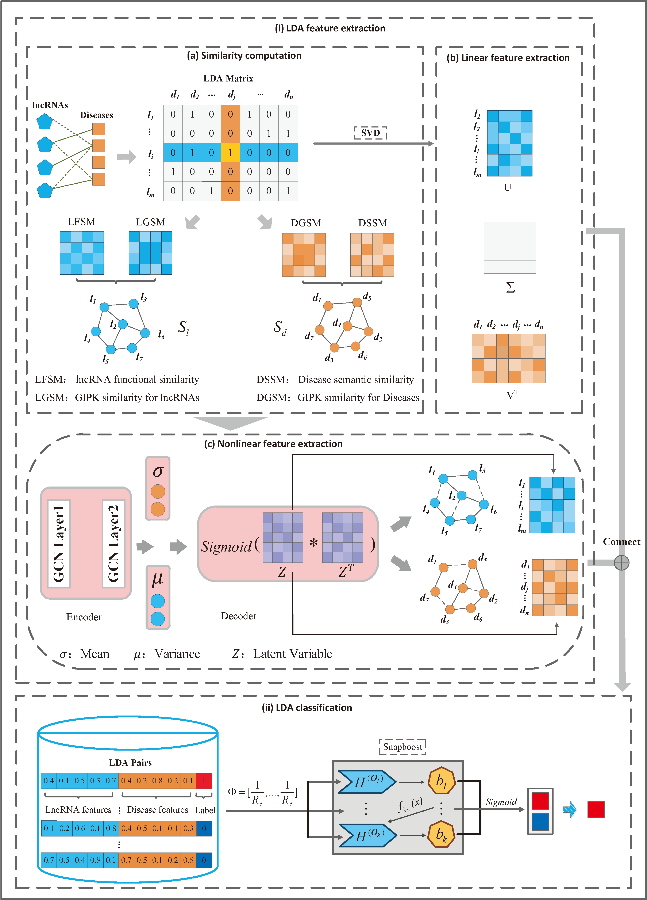

# LDA-VGHB: identifying potential lncRNA-disease associations with singular value decomposition, variational graph auto-encoder, and heterogeneous Newton boosting machine


## Data
In this work，lncRNADisease is data1 and MNDR is data2.
## Environment
Install python3.7 for running this model. And these packages should be satisfied:

 - tensorflow-gpu $\approx$ 2.6.0
 - numpy $\approx$ 1.19.5
 - pandas $\approx$ 1.1.5
 - scikit-learn $\approx$ 0.24.2
 - pai4sk == 3.5.2
## Usage
Default is 5-fold cross validation from $CV_{l}$ to $CV_{ind}$ on lncRNADisease  and MNDR databases. To run this model：
```
python mian.py
```
Extracting linear features for diseases and lncRNAs by SVD, to run:
```
python svd_feature/matrix_svd.py
```
Extracting nonlinear features for diseases and lncRNAs by VGAE, to run:
```
python nonlinear_feature/VGAE.py
```
